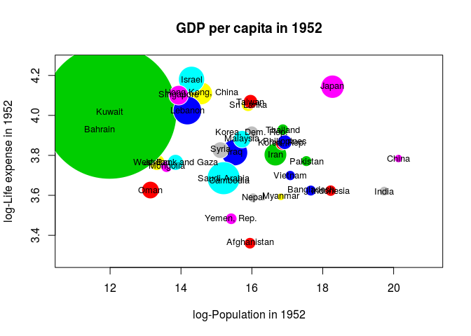
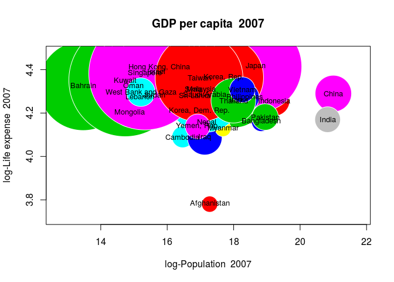

hw01\_gapminder
================
Yijun Xie
2016-09-20

### 1. Data Overview

*hide the output because the install process would creat a huge chunk of unnecessary output*

    ## Warning: Username parameter is deprecated. Please use cboettig/
    ## knitcitations

    ## Skipping install of 'knitcitations' from a github remote, the SHA1 (2f6c1026) has not changed since last install.
    ##   Use `force = TRUE` to force installation

    ## Loading required package: knitcitations

    ## Loading required package: gapminder

    ## Loading required package: tibble

    ## # A tibble: 1,704 × 6
    ##        country continent  year lifeExp      pop gdpPercap
    ##         <fctr>    <fctr> <int>   <dbl>    <int>     <dbl>
    ## 1  Afghanistan      Asia  1952  28.801  8425333  779.4453
    ## 2  Afghanistan      Asia  1957  30.332  9240934  820.8530
    ## 3  Afghanistan      Asia  1962  31.997 10267083  853.1007
    ## 4  Afghanistan      Asia  1967  34.020 11537966  836.1971
    ## 5  Afghanistan      Asia  1972  36.088 13079460  739.9811
    ## 6  Afghanistan      Asia  1977  38.438 14880372  786.1134
    ## 7  Afghanistan      Asia  1982  39.854 12881816  978.0114
    ## 8  Afghanistan      Asia  1987  40.822 13867957  852.3959
    ## 9  Afghanistan      Asia  1992  41.674 16317921  649.3414
    ## 10 Afghanistan      Asia  1997  41.763 22227415  635.3414
    ## # ... with 1,694 more rows

### 2. Extract Asian countries

``` r
data(gapminder)
asia_countries_2007 = gapminder[gapminder[,2] == 'Asia' & gapminder[,3] == 2007,]

asia_countries_1952 = gapminder[gapminder[,2] == 'Asia' & gapminder[,3] == 1952,]

countries = as.character(as.data.frame(asia_countries_1952)[,1])
```

### 3. Compare GPD per capita in 1952 and 2007

Compare the GPD per capita for Asian countries in 1952 and 2007.(“How to Make Bubble Charts,” n.d.)

``` r
## Ideas of bubble charts
r_1952 = sqrt(asia_countries_1952$gdpPercap / pi)

symbols(log(asia_countries_1952$pop),log(asia_countries_1952$lifeExp),circles = r_1952,fg="white", bg=2:8, xlab="log-Population in 1952", ylab="log-Life expense in 1952",main = 'GDP per capita in 1952')
text(log(asia_countries_1952$pop),log(asia_countries_1952$lifeExp), countries, cex=0.8)
```



``` r
r_2007 = sqrt(asia_countries_2007$gdpPercap / pi)

symbols(log(asia_countries_2007$pop),log(asia_countries_2007$lifeExp),circles = r_2007,fg="white", bg=2:8, xlab="log-Population  2007", ylab="log-Life expense  2007",main = 'GDP per capita  2007')
text(log(asia_countries_2007$pop),log(asia_countries_2007$lifeExp), countries, cex=0.8)
```



“How to Make Bubble Charts.” n.d. <https://flowingdata.com/2010/11/23/how-to-make-bubble-charts/>.
