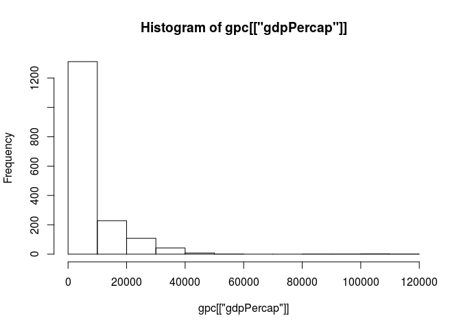
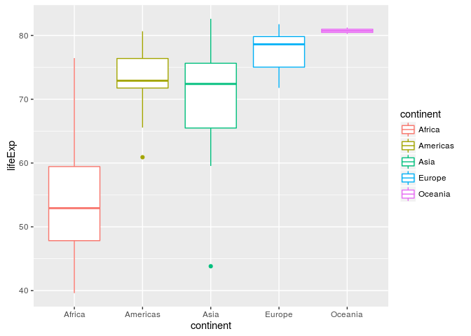
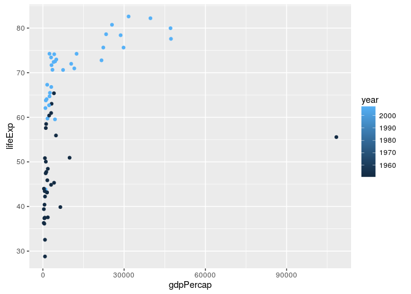
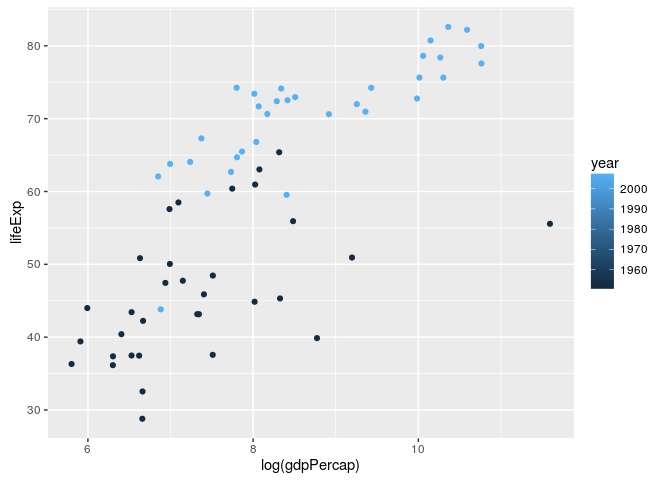
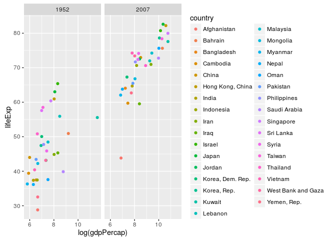
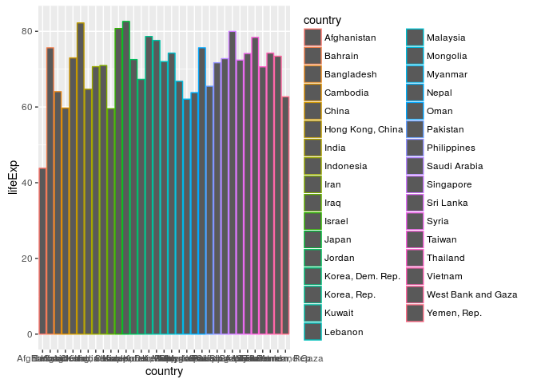
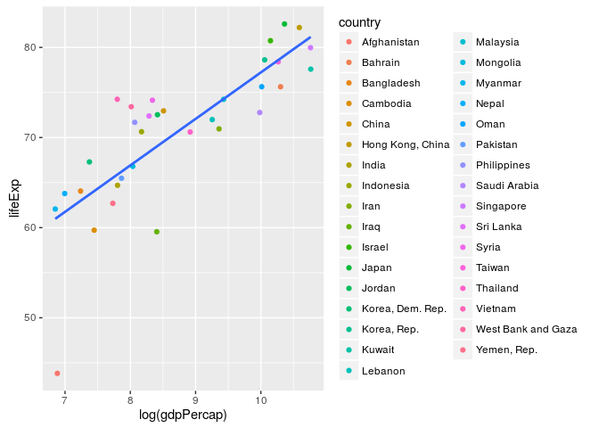
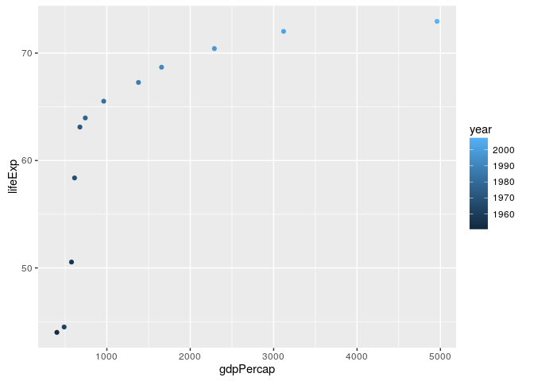
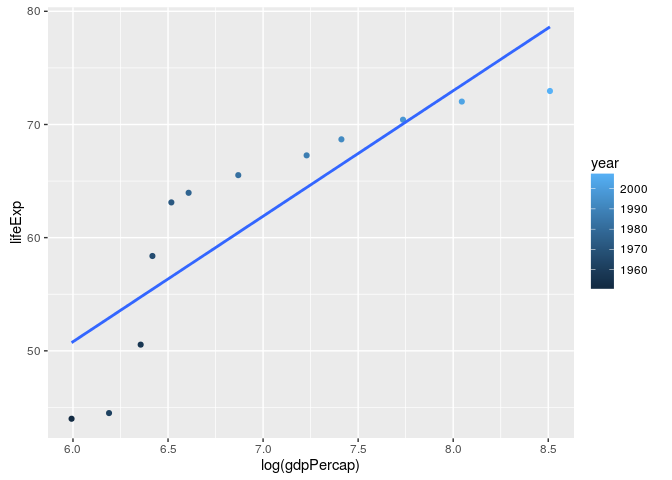

Homework 02: Explore Gapminder and use dplyr
================
Yijun Xie
September 26, 2016

### Loading Packages

``` r
install.packages("gapminder",repos="http://cran.rstudio.com/")
```

    ## Installing package into '/home/xyj/R/x86_64-pc-linux-gnu-library/3.3'
    ## (as 'lib' is unspecified)

``` r
library(gapminder)
install.packages("tidyverse",repos="http://cran.rstudio.com/")
```

    ## Installing package into '/home/xyj/R/x86_64-pc-linux-gnu-library/3.3'
    ## (as 'lib' is unspecified)

``` r
library(tidyverse)
```

    ## Loading tidyverse: ggplot2
    ## Loading tidyverse: tibble
    ## Loading tidyverse: tidyr
    ## Loading tidyverse: readr
    ## Loading tidyverse: purrr
    ## Loading tidyverse: dplyr

    ## Conflicts with tidy packages ----------------------------------------------

    ## filter(): dplyr, stats
    ## lag():    dplyr, stats

### Smell test the data

``` r
data("gapminder")
str(gapminder)
```

    ## Classes 'tbl_df', 'tbl' and 'data.frame':    1704 obs. of  6 variables:
    ##  $ country  : Factor w/ 142 levels "Afghanistan",..: 1 1 1 1 1 1 1 1 1 1 ...
    ##  $ continent: Factor w/ 5 levels "Africa","Americas",..: 3 3 3 3 3 3 3 3 3 3 ...
    ##  $ year     : int  1952 1957 1962 1967 1972 1977 1982 1987 1992 1997 ...
    ##  $ lifeExp  : num  28.8 30.3 32 34 36.1 ...
    ##  $ pop      : int  8425333 9240934 10267083 11537966 13079460 14880372 12881816 13867957 16317921 22227415 ...
    ##  $ gdpPercap: num  779 821 853 836 740 ...

``` r
class(gapminder)
```

    ## [1] "tbl_df"     "tbl"        "data.frame"

Therefore, gapminder is a data.frame.

``` r
ncol(gapminder) 
```

    ## [1] 6

``` r
nrow(gapminder)
```

    ## [1] 1704

``` r
glimpse(gapminder)
```

    ## Observations: 1,704
    ## Variables: 6
    ## $ country   <fctr> Afghanistan, Afghanistan, Afghanistan, Afghanistan,...
    ## $ continent <fctr> Asia, Asia, Asia, Asia, Asia, Asia, Asia, Asia, Asi...
    ## $ year      <int> 1952, 1957, 1962, 1967, 1972, 1977, 1982, 1987, 1992...
    ## $ lifeExp   <dbl> 28.801, 30.332, 31.997, 34.020, 36.088, 38.438, 39.8...
    ## $ pop       <int> 8425333, 9240934, 10267083, 11537966, 13079460, 1488...
    ## $ gdpPercap <dbl> 779.4453, 820.8530, 853.1007, 836.1971, 739.9811, 78...

``` r
dim(gapminder)
```

    ## [1] 1704    6

-   Gapminder has 6 variables/columns, and 1704 rows/observations.
-   The variables 'country' and 'continent' are categorical variables.
-   'year', 'lifeExp', 'pop', and 'gdpPercap' are quantitative variables.

### Explore individual variables

``` r
country = gapminder %>% select(country) # extract country column from the data
gpc = gapminder %>% select(gdpPercap)# extract gdpPercap column from the data
summary(country)
```

    ##         country    
    ##  Afghanistan:  12  
    ##  Albania    :  12  
    ##  Algeria    :  12  
    ##  Angola     :  12  
    ##  Argentina  :  12  
    ##  Australia  :  12  
    ##  (Other)    :1632

``` r
summary(gpc)
```

    ##    gdpPercap       
    ##  Min.   :   241.2  
    ##  1st Qu.:  1202.1  
    ##  Median :  3531.8  
    ##  Mean   :  7215.3  
    ##  3rd Qu.:  9325.5  
    ##  Max.   :113523.1

``` r
gapminder[which.max(gpc[["gdpPercap"]]),] # highest gdpPercap
```

    ## # A tibble: 1 × 6
    ##   country continent  year lifeExp    pop gdpPercap
    ##    <fctr>    <fctr> <int>   <dbl>  <int>     <dbl>
    ## 1  Kuwait      Asia  1957  58.033 212846  113523.1

``` r
gapminder[which.min(gpc[["gdpPercap"]]),] # lowest gdpPercap
```

    ## # A tibble: 1 × 6
    ##            country continent  year lifeExp      pop gdpPercap
    ##             <fctr>    <fctr> <int>   <dbl>    <int>     <dbl>
    ## 1 Congo, Dem. Rep.    Africa  2002  44.966 55379852  241.1659

``` r
hist(gpc[["gdpPercap"]])
```



``` r
gdppc_2007 = gapminder %>% 
  filter(year == 2007) %>% 
  select(gdpPercap)

sum(gdppc_2007 <= 20000) / nrow(gdppc_2007) # proportion of countries in 2007 have GDP per cap lower than 20000
```

    ## [1] 0.7676056

-   All countries have 12 entries in this dataset.
-   The highest GPD per capita is 113523.1 from Kuwait in 1957.
-   The lowest GPD per capita is 241.1659 from Congo in 2002.
-   Most contries(76.8%) haveing GPD per capita lower than 20000 in 2007.
-   Seems like us human beings are not doing so well in the last century.

### Explore various plot types

First we look at the distribtuion of life expentancy in different contients in 2007.

``` r
gapminder %>% 
  filter(year == 2007) %>% 
  select(c(country,continent,lifeExp)) %>% 
  ggplot(mapping = aes(x = continent, y = lifeExp)) + 
  geom_boxplot(aes(group = continent,color = continent))
```



Let's focus on Asia.

``` r
gapminder %>% 
  filter(continent == "Asia", year == 1952|year == 2007) %>% 
  ggplot(mapping = aes(y = lifeExp,x = gdpPercap))+
  geom_point(aes(color = year))
```



I plot the population vs GDP per capita in 1952 and 2007 in this plot. Most dots are in the left part of the plot. It would be reasonable to take logarithm on GPD per capita.

``` r
gapminder %>% 
  filter(continent == "Asia", year == 1952|year == 2007) %>% 
  ggplot(mapping = aes(y = lifeExp,x = log(gdpPercap)))+
  geom_point(aes(color = year))
```



And if we want to separate the two years apart we can plot them into two figures.

``` r
gapminder %>% 
  filter(continent == "Asia", year == 1952|year == 2007) %>% 
  ggplot(mapping = aes(y = lifeExp,x = log(gdpPercap)))+
  geom_point(aes(color = country)) + facet_wrap(~year)
```



We can plot a bar plot for the life expectancy in Asian countries in 2007.

``` r
gapminder %>% 
  filter(continent == "Asia") %>% 
  filter(year == 2007) %>% 
  ggplot(mapping = aes(country,lifeExp)) + 
  geom_bar(stat="identity",aes(color = country))
```



Plot a regression line on the log(gdpPercap) and lifeExp. It seems pretty linear.

``` r
gapminder %>% 
  filter(continent == "Asia" & year == 2007) %>% 
  ggplot(mapping =  aes(x = log(gdpPercap), y = lifeExp)) +
  geom_point(aes(color = country)) + geom_smooth(method = 'lm',se = F)
```



And we can focus on only one country and see if the linear relationship between log(gdpPercap) and lifeExp is true for historical data.

``` r
gapminder %>% 
  filter(country == 'China') %>% 
  ggplot(gapminder,mapping =  aes(x = gdpPercap, y = lifeExp)) +
  geom_point(aes(color = year))
```



``` r
gapminder %>% 
  filter(country == 'China') %>% 
  ggplot(gapminder,mapping =  aes(x = log(gdpPercap), y = lifeExp)) +
  geom_point(aes(color = year)) + geom_smooth(method = 'lm',se = F)
```



### Something more

``` r
# Sample code
filter(gapminder, country == c("Rwanda", "Afghanistan"))
```

    ## # A tibble: 12 × 6
    ##        country continent  year lifeExp      pop gdpPercap
    ##         <fctr>    <fctr> <int>   <dbl>    <int>     <dbl>
    ## 1  Afghanistan      Asia  1957  30.332  9240934  820.8530
    ## 2  Afghanistan      Asia  1967  34.020 11537966  836.1971
    ## 3  Afghanistan      Asia  1977  38.438 14880372  786.1134
    ## 4  Afghanistan      Asia  1987  40.822 13867957  852.3959
    ## 5  Afghanistan      Asia  1997  41.763 22227415  635.3414
    ## 6  Afghanistan      Asia  2007  43.828 31889923  974.5803
    ## 7       Rwanda    Africa  1952  40.000  2534927  493.3239
    ## 8       Rwanda    Africa  1962  43.000  3051242  597.4731
    ## 9       Rwanda    Africa  1972  44.600  3992121  590.5807
    ## 10      Rwanda    Africa  1982  46.218  5507565  881.5706
    ## 11      Rwanda    Africa  1992  23.599  7290203  737.0686
    ## 12      Rwanda    Africa  2002  43.413  7852401  785.6538

This code doesn't work because it will pick the rows with country name "Rwanda" and "Afghanistan" in turn. Therefore, the subset extracted from the original dataset will not be complete.

``` r
R_and_A = filter(gapminder, country == "Rwanda" |  country == "Afghanistan")
knitr::kable(R_and_A )
```

| country     | continent |  year|  lifeExp|       pop|  gdpPercap|
|:------------|:----------|-----:|--------:|---------:|----------:|
| Afghanistan | Asia      |  1952|   28.801|   8425333|   779.4453|
| Afghanistan | Asia      |  1957|   30.332|   9240934|   820.8530|
| Afghanistan | Asia      |  1962|   31.997|  10267083|   853.1007|
| Afghanistan | Asia      |  1967|   34.020|  11537966|   836.1971|
| Afghanistan | Asia      |  1972|   36.088|  13079460|   739.9811|
| Afghanistan | Asia      |  1977|   38.438|  14880372|   786.1134|
| Afghanistan | Asia      |  1982|   39.854|  12881816|   978.0114|
| Afghanistan | Asia      |  1987|   40.822|  13867957|   852.3959|
| Afghanistan | Asia      |  1992|   41.674|  16317921|   649.3414|
| Afghanistan | Asia      |  1997|   41.763|  22227415|   635.3414|
| Afghanistan | Asia      |  2002|   42.129|  25268405|   726.7341|
| Afghanistan | Asia      |  2007|   43.828|  31889923|   974.5803|
| Rwanda      | Africa    |  1952|   40.000|   2534927|   493.3239|
| Rwanda      | Africa    |  1957|   41.500|   2822082|   540.2894|
| Rwanda      | Africa    |  1962|   43.000|   3051242|   597.4731|
| Rwanda      | Africa    |  1967|   44.100|   3451079|   510.9637|
| Rwanda      | Africa    |  1972|   44.600|   3992121|   590.5807|
| Rwanda      | Africa    |  1977|   45.000|   4657072|   670.0806|
| Rwanda      | Africa    |  1982|   46.218|   5507565|   881.5706|
| Rwanda      | Africa    |  1987|   44.020|   6349365|   847.9912|
| Rwanda      | Africa    |  1992|   23.599|   7290203|   737.0686|
| Rwanda      | Africa    |  1997|   36.087|   7212583|   589.9445|
| Rwanda      | Africa    |  2002|   43.413|   7852401|   785.6538|
| Rwanda      | Africa    |  2007|   46.242|   8860588|   863.0885|

We use the logic operator "or" to tell R to extract all rows with country name "Rwanda" and "Afghanistan".
