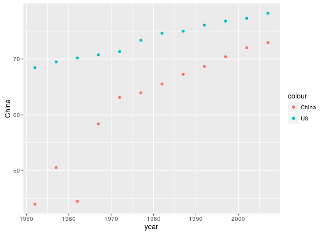
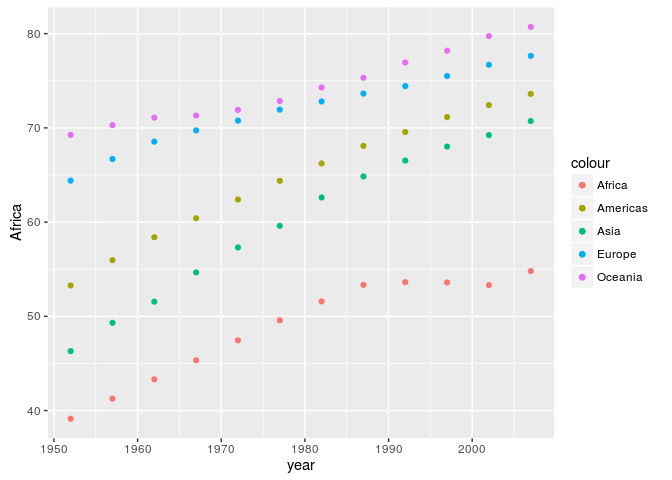

Homework\_04\_Tidy\_data\_and\_joins
================
Yijun Xie
October 11, 2016

``` r
## loading libraries
library(dplyr)
library(tidyverse)
library(ggplot2)
library(gapminder)
data(mtcars)
```

1. General data reshaping and relationship to aggregation
---------------------------------------------------------

### Activity \#2

``` r
# select life expectancy of China and US for each year
# each row represents a year, and each column represents a country
dat1 = gapminder %>% 
  filter(country %in% c("China","United States")) %>% 
  select(country,year,lifeExp) %>% 
  spread(country,lifeExp) %>% 
  mutate(US = `United States`) %>% 
  select(-c(`United States`)) 

knitr::kable(dat1)
```

|  year|     China|      US|
|-----:|---------:|-------:|
|  1952|  44.00000|  68.440|
|  1957|  50.54896|  69.490|
|  1962|  44.50136|  70.210|
|  1967|  58.38112|  70.760|
|  1972|  63.11888|  71.340|
|  1977|  63.96736|  73.380|
|  1982|  65.52500|  74.650|
|  1987|  67.27400|  75.020|
|  1992|  68.69000|  76.090|
|  1997|  70.42600|  76.810|
|  2002|  72.02800|  77.310|
|  2007|  72.96100|  78.242|

``` r
# plot the scatter plot of life expectancy for two countries
ggplot(dat1, aes(year)) + 
  geom_point(aes(y = China, colour = "China")) + 
  geom_point(aes(y = US, colour = "US"))
```



### Activity \#3

``` r
# mean life expectancy of each continent for each year
# each row represents a year, and each column represents a country
dat2 = gapminder %>% 
  select(continent,year,lifeExp) %>% 
  group_by(continent,year) %>% 
  summarize(mean_life_exp = mean(lifeExp)) %>% 
  spread(continent,mean_life_exp)

knitr::kable(dat2)
```

|  year|    Africa|  Americas|      Asia|    Europe|  Oceania|
|-----:|---------:|---------:|---------:|---------:|--------:|
|  1952|  39.13550|  53.27984|  46.31439|  64.40850|  69.2550|
|  1957|  41.26635|  55.96028|  49.31854|  66.70307|  70.2950|
|  1962|  43.31944|  58.39876|  51.56322|  68.53923|  71.0850|
|  1967|  45.33454|  60.41092|  54.66364|  69.73760|  71.3100|
|  1972|  47.45094|  62.39492|  57.31927|  70.77503|  71.9100|
|  1977|  49.58042|  64.39156|  59.61056|  71.93777|  72.8550|
|  1982|  51.59287|  66.22884|  62.61794|  72.80640|  74.2900|
|  1987|  53.34479|  68.09072|  64.85118|  73.64217|  75.3200|
|  1992|  53.62958|  69.56836|  66.53721|  74.44010|  76.9450|
|  1997|  53.59827|  71.15048|  68.02052|  75.50517|  78.1900|
|  2002|  53.32523|  72.42204|  69.23388|  76.70060|  79.7400|
|  2007|  54.80604|  73.60812|  70.72848|  77.64860|  80.7195|

``` r
ggplot(dat2, aes(year)) + 
  geom_point(aes(y = Africa, colour = "Africa")) + 
  geom_point(aes(y = Americas, colour = "Americas")) + 
  geom_point(aes(y = Asia, colour = "Asia")) +
  geom_point(aes(y = Europe, colour = "Europe")) +
  geom_point(aes(y = Oceania, colour = "Oceania"))
```



With reshaping, we don't need to use the `facet_wrap` funciton to distinguish different continents, and can plot them into one graph.

2. Join, merge, look up
-----------------------

The dataset I am using here is the well-known `mtcars` dataset.

``` r
# extract manufactors information
# method about keeping the first word of a string comes from
# http://stackoverflow.com/questions/31925811/extract-first-word-from-a-column-and-insert-into-new-column
brands = gsub("([A-Za-z]+).*", "\\1", rownames(mtcars)) %>% 
  as.data.frame()

colnames(brands) = "manufactors"

# add the country of origion of these manufactors. 
# For some brands I have no idea where do they come from.
dat = brands %>% 
  distinct(manufactors) %>% 
  mutate(country = c("Japan",rep("Unknown",4),"Germany",rep("United States",3),
                     "Italy",rep("Japan",2), rep("United States",4), "Germany",
                     "United Kingdom","United States", "Italy", "Unknown", "Sweden"))

knitr::kable(dat)
```

| manufactors | country        |
|:------------|:---------------|
| Mazda       | Japan          |
| Datsun      | Unknown        |
| Hornet      | Unknown        |
| Valiant     | Unknown        |
| Duster      | Unknown        |
| Merc        | Germany        |
| Cadillac    | United States  |
| Lincoln     | United States  |
| Chrysler    | United States  |
| Fiat        | Italy          |
| Honda       | Japan          |
| Toyota      | Japan          |
| Dodge       | United States  |
| AMC         | United States  |
| Camaro      | United States  |
| Pontiac     | United States  |
| Porsche     | Germany        |
| Lotus       | United Kingdom |
| Ford        | United States  |
| Ferrari     | Italy          |
| Maserati    | Unknown        |
| Volvo       | Sweden         |

### Prompt 1

-   inner join: Select countries in gapminder that have car brands listed above. Since the gapminder is too large, I only keep the data from 2007.

``` r
knitr::kable(inner_join(dat, filter(gapminder,year == 2007)))
```

    ## Joining, by = "country"

    ## Warning in inner_join_impl(x, y, by$x, by$y, suffix$x, suffix$y): joining
    ## character vector and factor, coercing into character vector

| manufactors | country        | continent |  year|  lifeExp|        pop|  gdpPercap|
|:------------|:---------------|:----------|-----:|--------:|----------:|----------:|
| Mazda       | Japan          | Asia      |  2007|   82.603|  127467972|   31656.07|
| Merc        | Germany        | Europe    |  2007|   79.406|   82400996|   32170.37|
| Cadillac    | United States  | Americas  |  2007|   78.242|  301139947|   42951.65|
| Lincoln     | United States  | Americas  |  2007|   78.242|  301139947|   42951.65|
| Chrysler    | United States  | Americas  |  2007|   78.242|  301139947|   42951.65|
| Fiat        | Italy          | Europe    |  2007|   80.546|   58147733|   28569.72|
| Honda       | Japan          | Asia      |  2007|   82.603|  127467972|   31656.07|
| Toyota      | Japan          | Asia      |  2007|   82.603|  127467972|   31656.07|
| Dodge       | United States  | Americas  |  2007|   78.242|  301139947|   42951.65|
| AMC         | United States  | Americas  |  2007|   78.242|  301139947|   42951.65|
| Camaro      | United States  | Americas  |  2007|   78.242|  301139947|   42951.65|
| Pontiac     | United States  | Americas  |  2007|   78.242|  301139947|   42951.65|
| Porsche     | Germany        | Europe    |  2007|   79.406|   82400996|   32170.37|
| Lotus       | United Kingdom | Europe    |  2007|   79.425|   60776238|   33203.26|
| Ford        | United States  | Americas  |  2007|   78.242|  301139947|   42951.65|
| Ferrari     | Italy          | Europe    |  2007|   80.546|   58147733|   28569.72|
| Volvo       | Sweden         | Europe    |  2007|   80.884|    9031088|   33859.75|

-   semi join: Keep brands that from known countries listed in gapminder.

``` r
knitr::kable(semi_join(dat, gapminder))
```

    ## Joining, by = "country"

| manufactors | country        |
|:------------|:---------------|
| Merc        | Germany        |
| Porsche     | Germany        |
| Fiat        | Italy          |
| Ferrari     | Italy          |
| Mazda       | Japan          |
| Honda       | Japan          |
| Toyota      | Japan          |
| Volvo       | Sweden         |
| Lotus       | United Kingdom |
| Cadillac    | United States  |
| Lincoln     | United States  |
| Chrysler    | United States  |
| Dodge       | United States  |
| AMC         | United States  |
| Camaro      | United States  |
| Pontiac     | United States  |
| Ford        | United States  |

Or select countries that are have known car brands.

``` r
knitr::kable(semi_join(y=dat, x= filter(gapminder,year == 2007)))
```

    ## Joining, by = "country"

| country        | continent |  year|  lifeExp|        pop|  gdpPercap|
|:---------------|:----------|-----:|--------:|----------:|----------:|
| Japan          | Asia      |  2007|   82.603|  127467972|   31656.07|
| Germany        | Europe    |  2007|   79.406|   82400996|   32170.37|
| United States  | Americas  |  2007|   78.242|  301139947|   42951.65|
| Italy          | Europe    |  2007|   80.546|   58147733|   28569.72|
| United Kingdom | Europe    |  2007|   79.425|   60776238|   33203.26|
| Sweden         | Europe    |  2007|   80.884|    9031088|   33859.75|

-   left join: Return all rows from the list of brands, and all columns from list of car brands and country data.

``` r
knitr::kable(left_join(dat, filter(gapminder,year == 2007)))
```

    ## Joining, by = "country"

    ## Warning in left_join_impl(x, y, by$x, by$y, suffix$x, suffix$y): joining
    ## factor and character vector, coercing into character vector

| manufactors | country        | continent |  year|  lifeExp|        pop|  gdpPercap|
|:------------|:---------------|:----------|-----:|--------:|----------:|----------:|
| Mazda       | Japan          | Asia      |  2007|   82.603|  127467972|   31656.07|
| Datsun      | Unknown        | NA        |    NA|       NA|         NA|         NA|
| Hornet      | Unknown        | NA        |    NA|       NA|         NA|         NA|
| Valiant     | Unknown        | NA        |    NA|       NA|         NA|         NA|
| Duster      | Unknown        | NA        |    NA|       NA|         NA|         NA|
| Merc        | Germany        | Europe    |  2007|   79.406|   82400996|   32170.37|
| Cadillac    | United States  | Americas  |  2007|   78.242|  301139947|   42951.65|
| Lincoln     | United States  | Americas  |  2007|   78.242|  301139947|   42951.65|
| Chrysler    | United States  | Americas  |  2007|   78.242|  301139947|   42951.65|
| Fiat        | Italy          | Europe    |  2007|   80.546|   58147733|   28569.72|
| Honda       | Japan          | Asia      |  2007|   82.603|  127467972|   31656.07|
| Toyota      | Japan          | Asia      |  2007|   82.603|  127467972|   31656.07|
| Dodge       | United States  | Americas  |  2007|   78.242|  301139947|   42951.65|
| AMC         | United States  | Americas  |  2007|   78.242|  301139947|   42951.65|
| Camaro      | United States  | Americas  |  2007|   78.242|  301139947|   42951.65|
| Pontiac     | United States  | Americas  |  2007|   78.242|  301139947|   42951.65|
| Porsche     | Germany        | Europe    |  2007|   79.406|   82400996|   32170.37|
| Lotus       | United Kingdom | Europe    |  2007|   79.425|   60776238|   33203.26|
| Ford        | United States  | Americas  |  2007|   78.242|  301139947|   42951.65|
| Ferrari     | Italy          | Europe    |  2007|   80.546|   58147733|   28569.72|
| Maserati    | Unknown        | NA        |    NA|       NA|         NA|         NA|
| Volvo       | Sweden         | Europe    |  2007|   80.884|    9031088|   33859.75|

-   anti join: List brands that I don't know where do they come from

``` r
knitr::kable(anti_join(dat, gapminder))
```

    ## Joining, by = "country"

| manufactors | country |
|:------------|:--------|
| Datsun      | Unknown |
| Hornet      | Unknown |
| Valiant     | Unknown |
| Duster      | Unknown |
| Maserati    | Unknown |

``` r
merge(dat, filter(gapminder,year == 2007))
```

    ##           country manufactors continent year lifeExp       pop gdpPercap
    ## 1         Germany        Merc    Europe 2007  79.406  82400996  32170.37
    ## 2         Germany     Porsche    Europe 2007  79.406  82400996  32170.37
    ## 3           Italy        Fiat    Europe 2007  80.546  58147733  28569.72
    ## 4           Italy     Ferrari    Europe 2007  80.546  58147733  28569.72
    ## 5           Japan       Honda      Asia 2007  82.603 127467972  31656.07
    ## 6           Japan      Toyota      Asia 2007  82.603 127467972  31656.07
    ## 7           Japan       Mazda      Asia 2007  82.603 127467972  31656.07
    ## 8          Sweden       Volvo    Europe 2007  80.884   9031088  33859.75
    ## 9  United Kingdom       Lotus    Europe 2007  79.425  60776238  33203.26
    ## 10  United States         AMC  Americas 2007  78.242 301139947  42951.65
    ## 11  United States    Cadillac  Americas 2007  78.242 301139947  42951.65
    ## 12  United States     Lincoln  Americas 2007  78.242 301139947  42951.65
    ## 13  United States      Camaro  Americas 2007  78.242 301139947  42951.65
    ## 14  United States     Pontiac  Americas 2007  78.242 301139947  42951.65
    ## 15  United States    Chrysler  Americas 2007  78.242 301139947  42951.65
    ## 16  United States        Ford  Americas 2007  78.242 301139947  42951.65
    ## 17  United States       Dodge  Americas 2007  78.242 301139947  42951.65

The `merge` fucntion, as its name indicates, will merge two datasets into one, while the `join` function will either put them side by side, or only keep one of them and use the other one as selection criteria.

``` r
match(dat$country,gapminder$country)
```

    ##  [1]  793   NA   NA   NA   NA  565 1609 1609 1609  769  793  793 1609 1609
    ## [15] 1609 1609  565 1597 1609  769   NA 1465

``` r
gapminder[na.omit(match(dat$country,gapminder$country)),]
```

    ## # A tibble: 17 × 6
    ##           country continent  year lifeExp       pop gdpPercap
    ##            <fctr>    <fctr> <int>   <dbl>     <int>     <dbl>
    ## 1           Japan      Asia  1952   63.03  86459025  3216.956
    ## 2         Germany    Europe  1952   67.50  69145952  7144.114
    ## 3   United States  Americas  1952   68.44 157553000 13990.482
    ## 4   United States  Americas  1952   68.44 157553000 13990.482
    ## 5   United States  Americas  1952   68.44 157553000 13990.482
    ## 6           Italy    Europe  1952   65.94  47666000  4931.404
    ## 7           Japan      Asia  1952   63.03  86459025  3216.956
    ## 8           Japan      Asia  1952   63.03  86459025  3216.956
    ## 9   United States  Americas  1952   68.44 157553000 13990.482
    ## 10  United States  Americas  1952   68.44 157553000 13990.482
    ## 11  United States  Americas  1952   68.44 157553000 13990.482
    ## 12  United States  Americas  1952   68.44 157553000 13990.482
    ## 13        Germany    Europe  1952   67.50  69145952  7144.114
    ## 14 United Kingdom    Europe  1952   69.18  50430000  9979.508
    ## 15  United States  Americas  1952   68.44 157553000 13990.482
    ## 16          Italy    Europe  1952   65.94  47666000  4931.404
    ## 17         Sweden    Europe  1952   71.86   7124673  8527.845

The `match` function only gives you the position where the first match appears.

Reflection: This homework is not very difficult. Also it is fun to play with two datasets together. And I learnt how to slice the string and only keep the first word.
