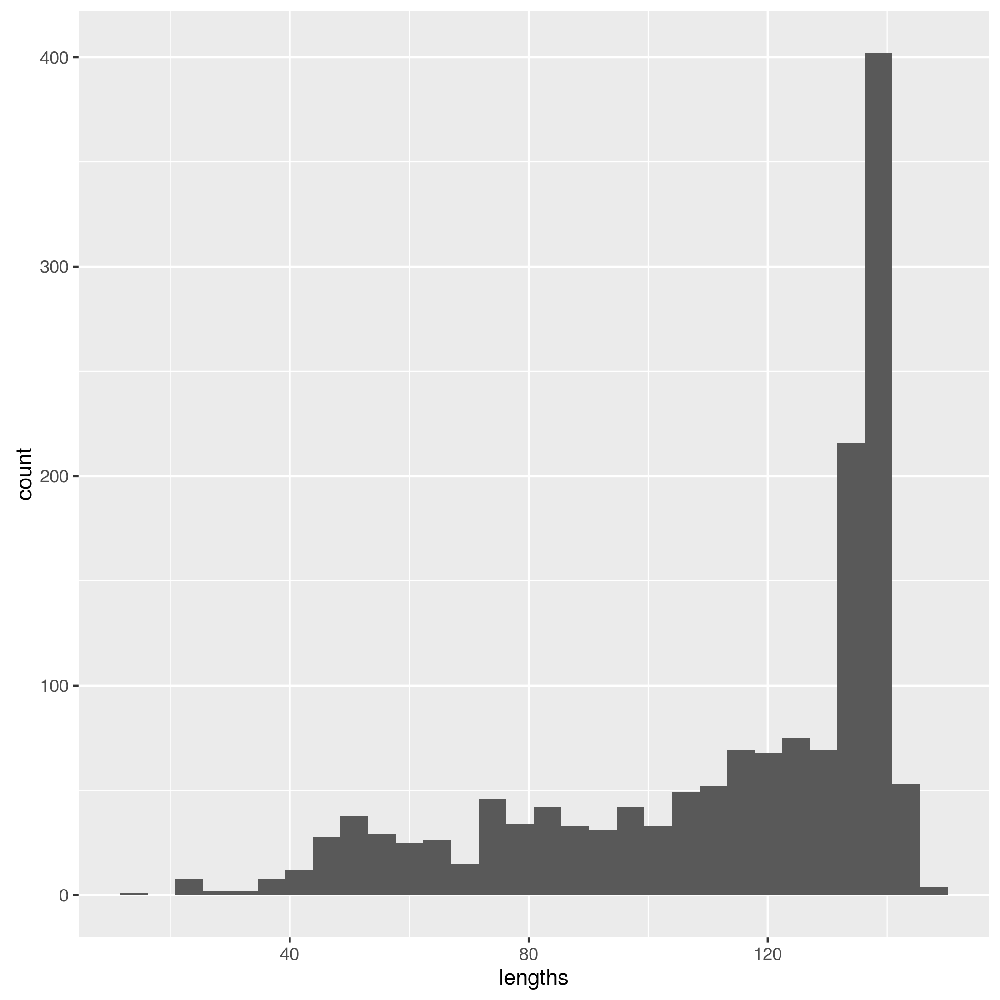
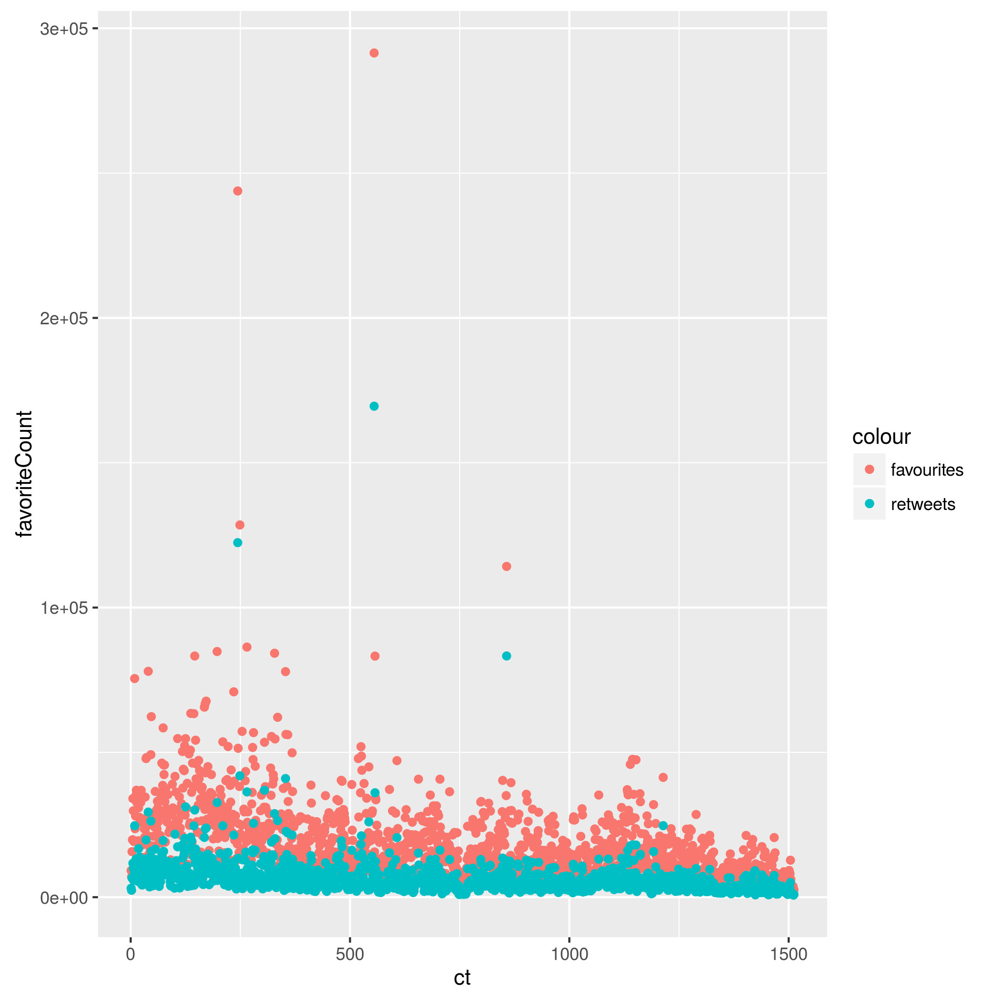

# Trump's Tweets (cont'd)
In `homework_06` I explored Trump's tweets related to China. In this homework, I would like to continue working on his tweets. First, let's do some exploratory analysis to see how many favourties and retweets did he get.

*Fig. 1* A histogram of lengths of Trump's tweets

And here is a plot of how long are his tweets.


*Fig. 2* A plot of number of favorites and retweets of Trump's tweets

Now I am interested in what is the most popular tweet of Trump and what is his shortest tweet.

There is one tweet with most favorites and retweets, and it should be considered as the most pouplar one. 
```{r,echo=F,message = F}
setwd("/home/xyj/Documents/STAT 545/xie_yijun/homework_07")
library(tidyverse)
load(url("http://varianceexplained.org/files/trump_tweets_df.rda"))
dat = trump_tweets_df
fav = dat %>% 
	select(favoriteCount)
most_pop = which.max(fav[[1]])
content = trump_tweets_df$text[most_pop]
print(content)
```
BRAVO!!! 

Now let's see what is the shortest tweet.
```{r,echo=F,message = F}
lengths = nchar(trump_tweets_df$text)
shortest = which.min(lengths)
(trump_tweets_df$text[shortest])
```
LOL I thought it might be simply "MAGA!"

# Reflection
Although the advantage of `Makefile` is not very obvious here, I can feel that it will be extremely useful when dealing with a large project. I really learning this technique.